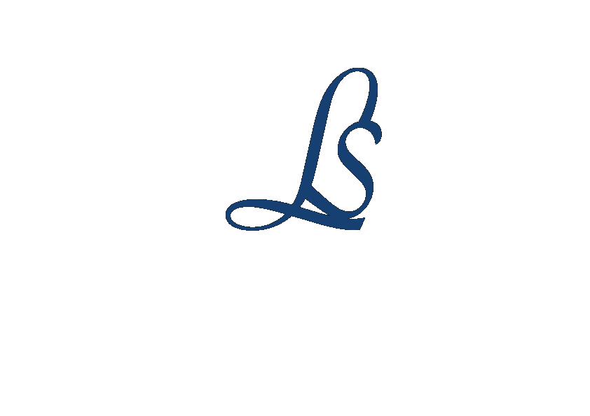

<div align="center">
  


  [](https://developer.mozilla.org/en-US/docs/Web/JavaScript)
  [](https://developer.mozilla.org/en-US/docs/Web/CSS)
  [](https://reactjs.org/)
  [](https://developers.google.com/web/tools/lighthouse)
[](https://getbootstrap.com/)
</div>


# Mon portfolio

Bienvenue sur mon portfolio en ligne. Je m'appelle Soukaina Larabi,une développeuse Web junior passionnée, spécialisée dans le développement front-end.

## Technologies

- JS
- CSS
- React

## Installation du Projet
Clonez le dépôt:

git clone https://github.com/Soukainalarabi/portfolio_react.git

### Installation des Dépendances Front-End
Installez toutes les dépendances pour le front-end:

```bash
npm install ou yarn add
```

### Lancement du Front-End
Lancez le front-end:
```bash
npm start ou yarn start
```
Le front-end sera accessible à l'URL: [http://localhost:3000/Portfolio_react/#/](http://localhost:3000/Portfolio_react/#/).


## Déploiement

Le site est actuellement déployé sur GitHub Pages. Vous pouvez y accéder en suivant ce lien : [Portfolio_react sur GitHub Pages](https://soukainalarabi.github.io/portfolio_react/).

## Tests de Performance

Ce projet a été soumis à des tests de performance à l'aide de Lighthouse afin de garantir une expérience utilisateur optimale.

